# Criando seu Primeiro Data Factory

## Introdução
Este guia apresenta os passos necessários para criar seu primeiro Azure Data Factory, uma solução de integração de dados na nuvem.

## Criando um Resource Group

1. Comece criando um resource group para organizar seus recursos
2. Para nomes de recursos, consulte as [Recomendações de abreviações para recursos do Azure](https://learn.microsoft.com/pt-br/azure/cloud-adoption-framework/ready/azure-best-practices/resource-abbreviations)

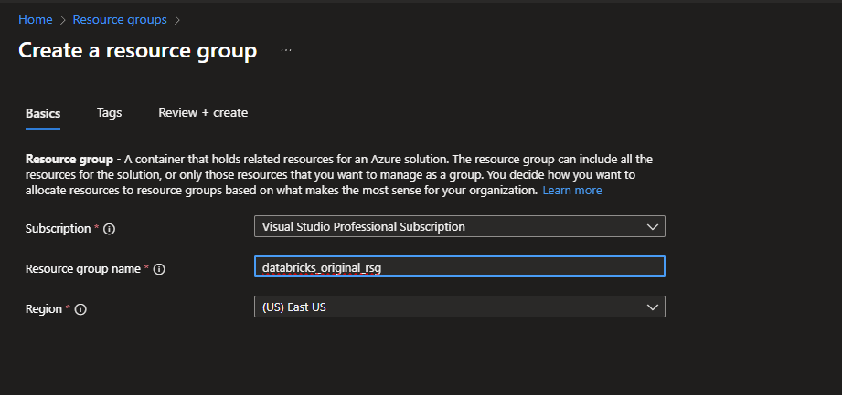
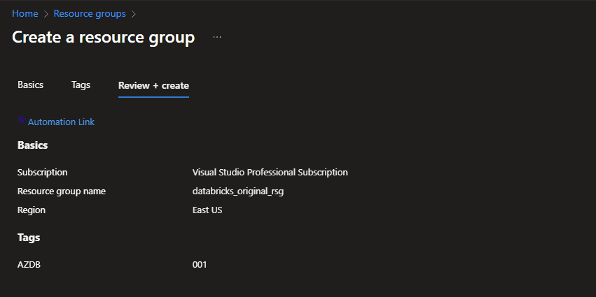

3. Após finalizar a criação, clique em "Go to resource group"

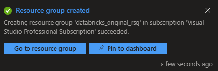

4. Resource Group criado com sucesso

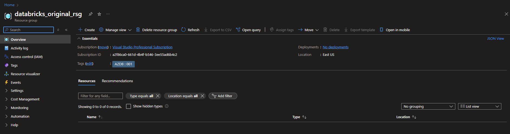

## Criando um Data Factory

1. Para criar um recurso dentro do resource group, clique em "Create" e pesquise pelo recurso desejado

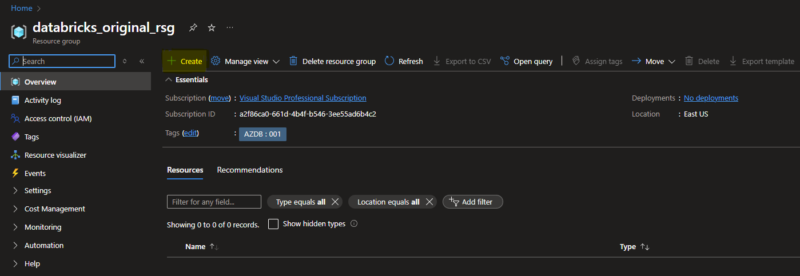

2. Clique em "Create" novamente para iniciar a criação do Azure Data Factory

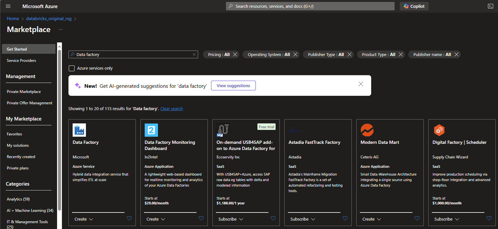

3. Configure as informações básicas:
   - Selecione sua subscrição
   - Escolha o resource group criado anteriormente
   - Forneça um nome único para o Data Factory
   - Escolha a região onde será hospedado
   - Mantenha o campo Version conforme a imagem

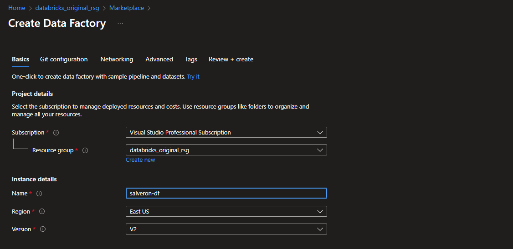

4. Na aba "Git configuration", você pode optar por configurar a conexão ao git ou Azure DevOps posteriormente, ou configurar durante a criação

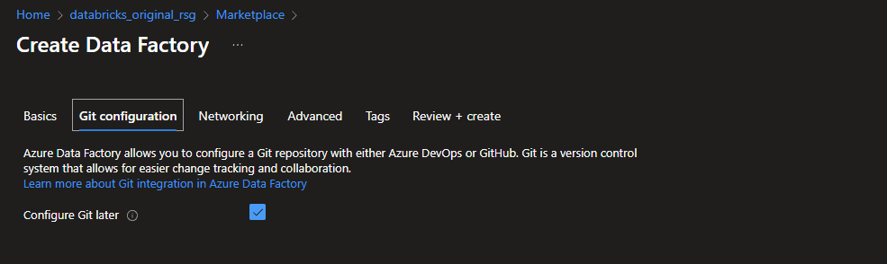
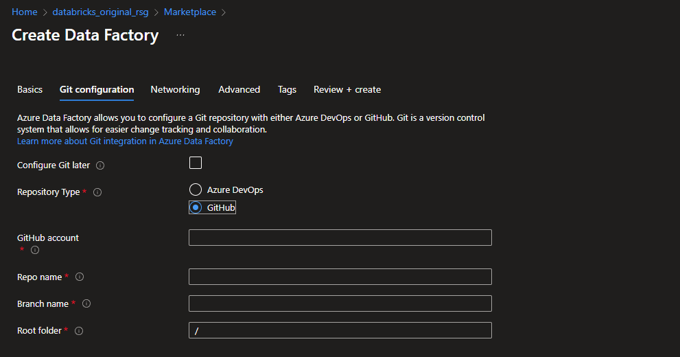

5. Nas abas seguintes, você pode configurar:
   - Configurações de rede
   - Opções de criptografia
   - Tags para o recurso

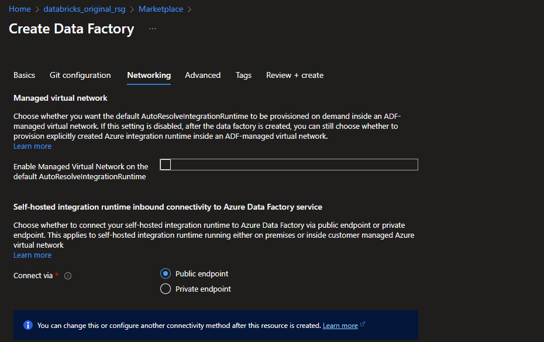
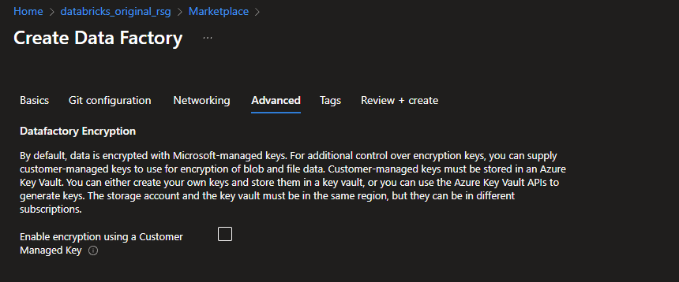
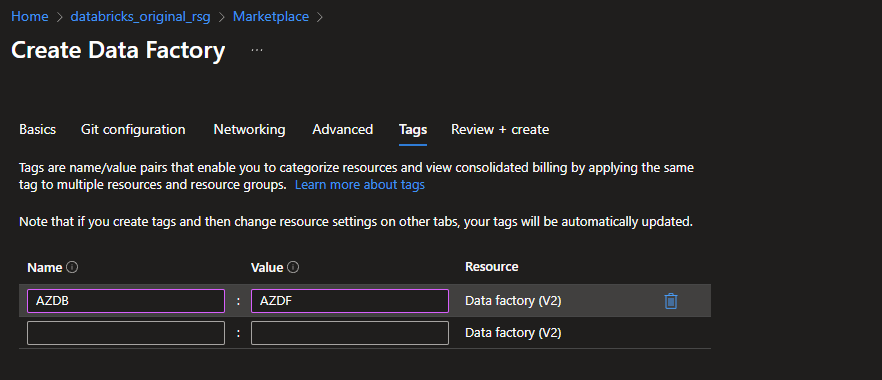

6. Clique em "Review + Create" e, após a validação, execute a criação
7. Acesse o recurso criado através do botão "Go to resource"

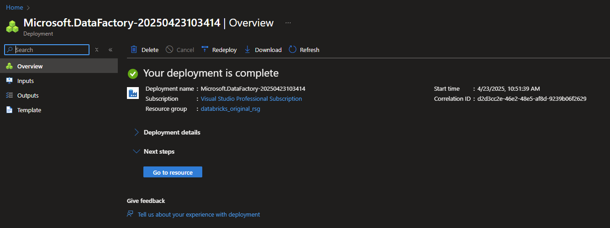

## Conclusão

Parabéns! Seu recurso foi criado com sucesso e está armazenado dentro do grupo de recursos (resource group) que criamos anteriormente.

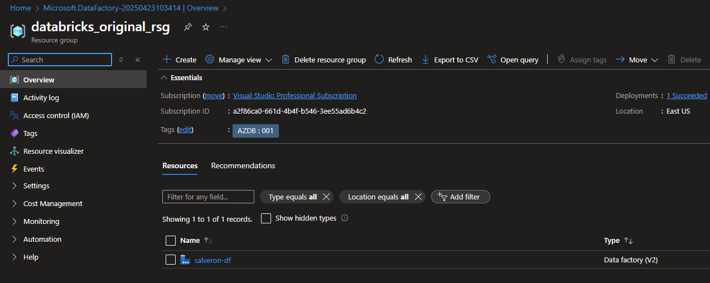
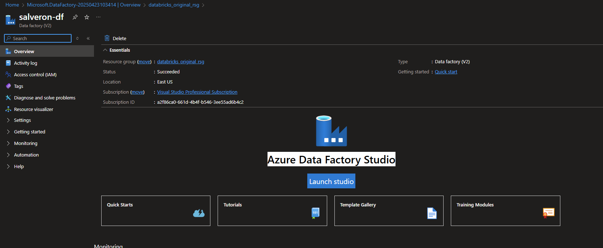

## Configurando Métricas

Após a criação tanto do Resource Group como do recurso Azure Data Factory, podemos criar métricas que analisam diversos cenários dentro do Data Factory.

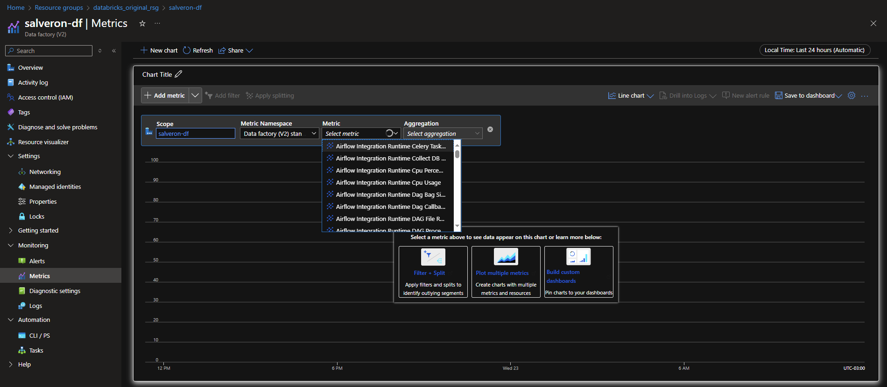

Após criar as métricas e alertas de acordo com a necessidade do negócio, você pode fixar as métricas no dashboard do Azure, clicando em "Save to dashboard" logo acima das métricas.

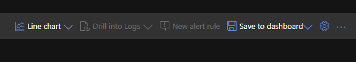

## Visualizando Métricas no Dashboard

Para visualizar o gráfico adicionado ao Dashboard, é só abrir o menu lateral e clicar em "Dashboard"

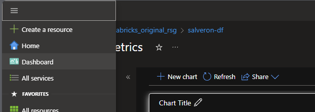

E aqui podemos visualizar as informações filtradas assim que o tempo for passando.

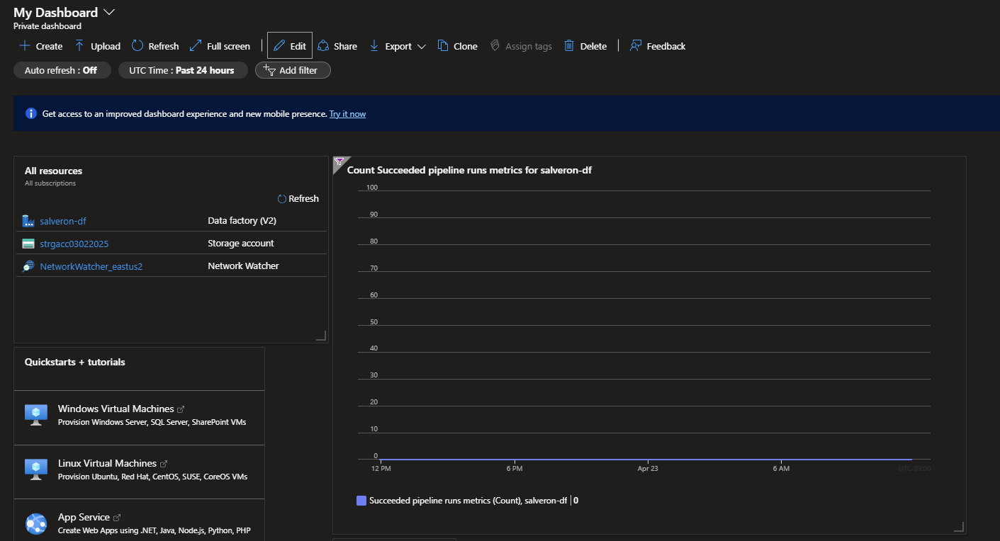

---
Este tutorial foi criado para ajudar na criação do seu primeiro Azure Data Factory e configuração de métricas. Para mais informações, consulte a [documentação oficial do Azure](https://learn.microsoft.com/pt-br/azure/data-factory/).

